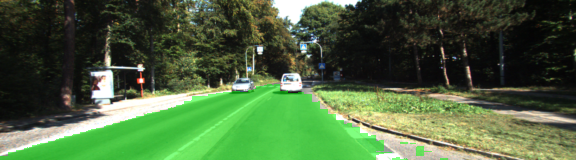
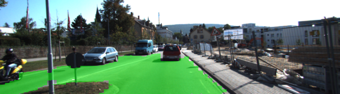
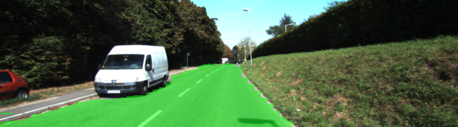
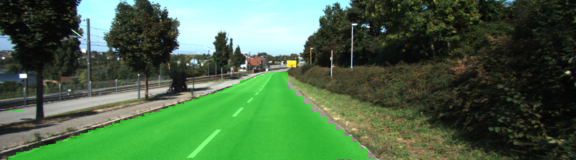
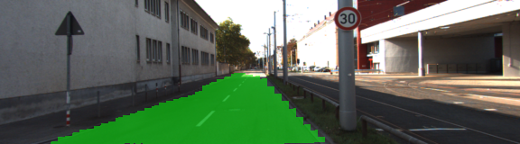
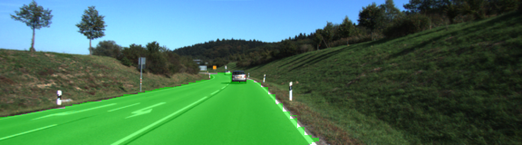
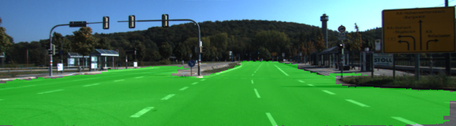
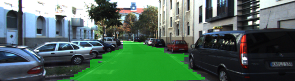

# Udacity-CarND-Semantic-Segmentation

## Introduction
The goal of this project is to classify every pixel of the image to find the drivable portion using a Fully Convolutional neural network based on VGG16 architecture.

## Architecture
* The number of desired classes are two: road and non-road
* Pretrained VGG-16 was converted to fully convolutional neural network using 1x1 convolutions instead of fully connected layers
* Performance of network is improved by using 2 Skip connections between the 4th layer and the 1x1 convolutional layer of decoder(layer 7 that upsamples the image) and 3rd layer with 1x convolutional layer of the decoder(output layer that upsamples the image from previous function)
* The kernel and stride values were mostly taken from classroom.
* I decided to use kernel of size 8x8 in the final layer instead of 16x16 mentioned in the classroom because I observered the results were much better with 8.

## Optimizer
* Loss function is cross entropy
* Optimizer is Adam Optimizer

## Hyperparameters
* Epoch: 25
* Batch Size: 5
* Keep Prob : 0.8
* Learning Rate: 0.001

## Results
* The results of all the test images is in runs folder
* Samples are included 
* Loss per batch after 10 epochs was around 0.2
* Loss per batch after 15 epochs was around 0.1
* Loss per batch after 20 epochs was around 0.07

